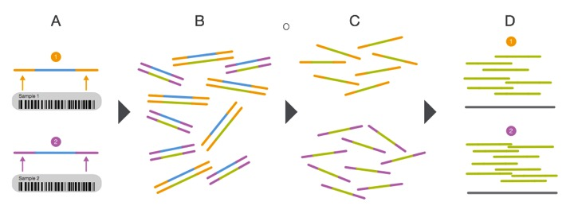
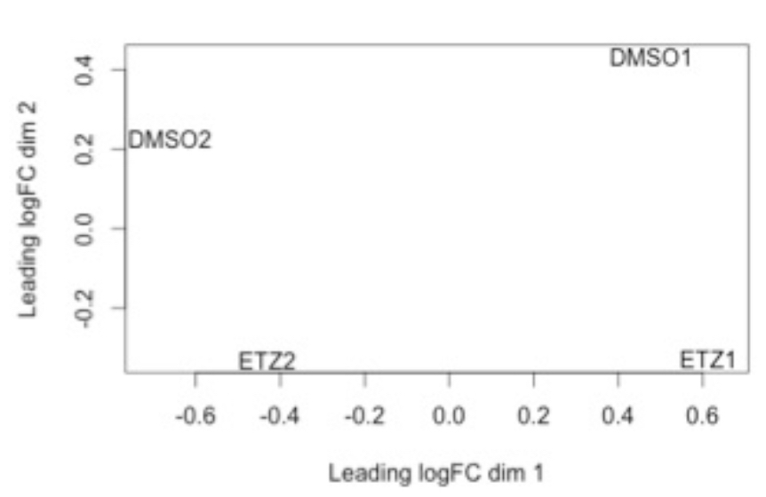

.. _rnaseqbackground:

RNA-seq background information, data analysis procedure, and details of the analysis tools
==========================================================================================

Before we dig into the data and begin trimming and aligning the reads to the genome, I think it is useful to understand what happens *after you submit your RNA to the sequencing facility*. This sort of knowledge can be very useful in understanding what could potentially provide bias and any number of issues to the end dataset. In this session we will cover several things including: 

#. :ref:`rnaseqbackgroundinfo`

#. :ref:`basicworkflow`

#. :ref:`trimmomatic`

#. :ref:`fastqc`

#. :ref:`bowtie`

#. :ref:`htseqbackground`

#. :ref:`edgerbackground`

.. _rnaseqbackgroundinfo:

RNA-seq background information
------------------------------

Before we begin, let's watch a video about how `Illumina sequencing works <https://www.youtube.com/watch?v=womKfikWlxM>`_.

This video does a pretty good job explaining how, in generalities the sequencing process works for DNA. So for sequencing RNA, the process is as follows:

.. image:: rnaseqworkflow.jpg
	:align: center
	:alt: RNAseq workflow
	
*Adapted from: Zhernakova et al., PLoS Genetics 2013*

So actually, we aren't sequencing RNA at all! We are sequencing the cDNA made from the RNA. RNA-seq is a high resolution next generation sequencing (NGS) method to assess the transcriptome of an organism and compare transcriptional changes between organisms/treatments to ascertain specific pathways/genes that are moving in response. But now, let's talk about what can add bias to the data and what we do with the data to make sure that it is reasonable to proceed to further analysis steps.

But first, let's brainstorm a little bit. Look back at the RNA-seq workflow figure above and let's suggest a few places where things could potentially affect the output dataset.

Here are a few thoughts...

	* How could the random priming step affect downstream results?
	* How could RNA secondary structures affect the library preparation process?
	* Would GC content be a problem?
	* Could gene length cause issues?
	* What might happen if you have genes with substantially different expression levels?
	* During the cluster generation on the Illumina flow cell, what might happen if you have too few clusters? Too many?
	* How is it possible to sequence many samples at one time?
	* What if you run out of reagents from one kit and have to open another kit to finish the library preparation process?
	* Could sequencing depth be an issue?
	
So now that you may be questioning the validity of any RNA-seq dataset, take heart! Many very smart people have thought about these issues and come up with ways to assess technical artifacts and correct for them. So again, let's brainstorm some potential solutions to these problems. Which problems can be addressed through better chemistries/processes vs. mathematical/computational correction?

These sorts of issues should always be considered, but recognize that RNA-seq is becoming fairly commonplace and solutions to many of these questions exist. Be critical of your data and *always* look at the raw data.

Multiplexing the sequencing process by pooling several samples together is not only cheaper, it can overcome what are known as *batch effects*. Batch effects are when you have samples that correlate with one another based on batch/time/etc. instead of biological replication. This is a very real phenomenon and can be caused by using different lots of the same kit/flow cells when preparing samples! You can correct for this, but we will get there later... For now, have a look at the diagram showing how multiplexing is achieved.

	
*From: http://www.illumina.com/content/dam/illumina-marketing/documents/products/sequencing_introduction_microbiology.pdf*

This is an example of what a *batch effect* looks like. Note how DMSO1 and ETZ1 group together and DMSO2 and ETZ2 group together (e.g. by batch).

We can determine what is considered a "good" base call from a "bad" one through using what is known as the Phred scoring system or Q-score.

Where Q is defined as a property that is logarithmically related to the base call error probability:

.. math::

	Q = -10 \log_{10} P\ |\ error\ probability = P^2
	
So this means:

.. image:: basecall.jpg
	:align: center
	:alt: Phred scoring table

*From: http://res.illumina.com/documents/products/technotes/technote_q-scores.pdf*

Illumina tends to output sequence results with a Q > 30. So let's have a look at what some raw data looks like in terms of Q-scores before and after trimming adapters and low quality reads.

.. image:: rawvstrimmedalign.jpg
	:align: center
	:alt: Raw vs trimmed alignment
	
This is why we do the trimming before attempting to align the reads to the reference genome. Since we are using FastQC, let's have a look at some sample data of what `good Illumina data looks like <http://www.bioinformatics.babraham.ac.uk/projects/fastqc/good_sequence_short_fastqc.html>`_.

So, we have come to the end of the background section. Even with all of the great tools and chemistries that have been developed to handle RNA-seq datasets, the old mantra still applies: *garbage in; garbage out* and *with great power comes great responsibility*. Take care in analyzing these sorts of data as they typically influence many downstream experiments.

**Questions!**

.. _basicworkflow:

Basic analysis procedure
------------------------

Now that we have began to understand the background of RNA-seq technologies, how libraries 
are prepared and sequenced, and thought aboutpotential pitfalls during the data analysis process,
let's have a look at the basic workflow and some tools that we will use for each step:

Remember that we can have both single- and paired-end reads. Each type of output will require
slightly different tools and procedure. The data that we will be working with is single-end
Illumina reads.

Let's brainstorm for a minute:
    * If the Illumina sequencing procedure (as seen in the video above) requires specific adapters, what are some ways we could remove them?
    * What are some potential issues specifically with our reads that could cause misalignments or no alignments at all to a reference genome?
    * Why don't we use a reference transcriptome instead of a genome since RNA-seq is a *transcriptional* profiling experiment?
    * What are other genomic features in bacteria that could potentially be identified using RNA-seq data?
    

.. _trimmomatic:

Trimmomatic
-----------

Trimmomatic is a lightweight java application that can remove Illumina adapter sequences and low quality reads. It uses a sliding window to analyze chunks of each read, examining the quality score, minimum read length, if it corresponds to an adapter sequence, etc. Let's have a look at the `documentation <http://www.usadellab.org/cms/index.php?page=trimmomatic>`_ to see what each option does.

When we run the analysis, you will likely see some output that looks like this::

    TrimmomaticSE: Started with arguments: -threads 4 /mnt/home/john3434/RNAseq/Data/gly7a.fq.gz /mnt/home/john3434/RNAseq/QC/trimmedgly7a.fq.gz ILLUMINACLIP:/opt/software/Trimmomatic/0.32/adapters/TruSeq3-SE.fa:2:30:10 LEADING:3 TRAILING:3 SLIDINGWINDOW:4:15 MINLEN:36
    Using Long Clipping Sequence: 'AGATCGGAAGAGCGTCGTGTAGGGAAAGAGTGTA'
    Using Long Clipping Sequence: 'AGATCGGAAGAGCACACGTCTGAACTCCAGTCAC'
    ILLUMINACLIP: Using 0 prefix pairs, 2 forward/reverse sequences, 0 forward only sequences, 0 reverse only sequences
    Quality encoding detected as phred33
    Input Reads: 100000 Surviving: 96867 (96.87%) Dropped: 3133 (3.13%)
    TrimmomaticSE: Completed successfully

.. note:: It is important to log this output into a text file somewhere and save it (fortunately the software we are going to use will log it for you). You might want this for a report when you're finished.

Let's remind ourselves what each command and parameter is doing. Look through the command and discuss with a neighbor what is going on there. If you don't remember what each parameter does, have another look at the `documentation <http://www.usadellab.org/cms/index.php?page=trimmomatic>`_.

**Let me know if you have questions by placing a red sticky note on your computer.**

.. _fastqc:

FastQC
------

FastQC is a piece of software that allows us to analyze the quality of our data before proceeding to aligning the reads to the reference genome. Let's have a look again at what `good Illumina data <http://www.bioinformatics.babraham.ac.uk/projects/fastqc/good_sequence_short_fastqc.html>`_ and `bad Illumina data <http://www.bioinformatics.babraham.ac.uk/projects/fastqc/bad_sequence_fastqc.html>`_ look like. This will help us determine the quality of our own sequence based on their examples.

The output from FastQC will look like this (with a different file name instead of 'trimmedgly7a.fq.gz'::

    Started analysis of trimmedgly7a.fq.gz
	Approx 5% complete for trimmedgly7a.fq.gz
	Approx 10% complete for trimmedgly7a.fq.gz
	Approx 15% complete for trimmedgly7a.fq.gz
	Approx 20% complete for trimmedgly7a.fq.gz
	Approx 25% complete for trimmedgly7a.fq.gz
	Approx 30% complete for trimmedgly7a.fq.gz
	Approx 35% complete for trimmedgly7a.fq.gz
	Approx 40% complete for trimmedgly7a.fq.gz
	Approx 45% complete for trimmedgly7a.fq.gz
	Approx 50% complete for trimmedgly7a.fq.gz
	Approx 55% complete for trimmedgly7a.fq.gz
	Approx 60% complete for trimmedgly7a.fq.gz
	Approx 65% complete for trimmedgly7a.fq.gz
	Approx 70% complete for trimmedgly7a.fq.gz
	Approx 75% complete for trimmedgly7a.fq.gz
	Approx 80% complete for trimmedgly7a.fq.gz
	Approx 85% complete for trimmedgly7a.fq.gz
	Approx 90% complete for trimmedgly7a.fq.gz
	Approx 95% complete for trimmedgly7a.fq.gz
	Analysis complete for trimmedgly7a.fq.gz

We can open the report file in a browser like FireFox. Here are two different reports :file:`report1.html` and :file:`report2.html` What do we think? Good or bad data?

Please work with a neighbor and discuss the FastQC analysis reports. Put a green sticky note on your computer once you have done this and viewed the results in a browser.

.. _bowtie:

Bowtie
------

**What is Bowtie?**

"Bowtie is an ultrafast, memory-efficient short read aligner geared toward quickly aligning large sets of short DNA sequences (reads) to large genomes... Bowtie indexes the genome with a `Burrows-Wheeler <http://en.wikipedia.org/wiki/Burrows%E2%80%93Wheeler_transform>`_ index to keep its memory footprint small..."

**What isn't Bowtie?**

"Bowtie is not a general-purpose alignment tool like MUMer, BLAST, or Vmatch. Bowtie works best when aligning short reads to large genomes, though it supports arbitrarily small reference sequences (e.g. amplicons) and reads as long as 1024 bases. Bowtie is designed to be extremely fast for sets of short reads where (a) many of the reads have at least one good, valid alignment, (b) many of the reads are relatively high-quality, and (c) the number of alignments reported per read is small (close to 1)."

*From: http://bowtie-bio.sourceforge.net/manual.shtml#what-is-bowtie*

In order for Bowtie to work, we need to provide it with trimmed reads files and the reference genome in a FASTA format file. This type of file typically ends in .fa or .fasta. 

We can acquire our favorite reference genome and feature file (GTF) from the `Ensembl website <http://bacteria.ensembl.org/info/website/ftp/index.html>`_.

Once we get our data from the RTSF, we will download the *L. reuteri* JCM1112 :download:`genome file <trimmedlreuterijcm1112.fa>` and :download:`feature file <alignlreuterijcm1112.gtf>`. The feature file contains data to inform HTSeq where the start and end of a gene is. This is important as HTSeq produces the number of transcripts per gene identified in a given sample.

.. _htseqbackground:

HTSeq
-----

This step will take the longest time, computationally, out of the entire workflow. 

`HTSeq <http://www-huber.embl.de/users/anders/HTSeq/doc/overview.html>`_ is a powerful Python package for analyzing NGS data. For our purposes, we will be using the counting feature of HTSeq. Let's have a look at the way HTSeq can `count whether a read maps to a gene <http://www-huber.embl.de/users/anders/HTSeq/doc/count.html#count>`_.

We need to supply htseq-count with a couple things:

#. A genome feature file (GTF) so that HTSeq "knows" where the start and end of a gene is

#. The *.sam* file that was output from Bowtie

.. _edgerbackground:

Differential gene expression with edgeR
---------------------------------------

Up to this point we have done several things: trimmed, QC'd, aligned, and counted reads that mapped to each gene. Now, we will finally move to the step where we will analyze the differential gene expression between the untreated and treated *L. reuteri* samples!

To do this, we have chosen to utilize an analysis package written in the R programming language called `edgeR <http://bioconductor.org/packages/release/bioc/vignettes/edgeR/inst/doc/edgeRUsersGuide.pdf>`_. edgeR stands for differential expression analysis of digital gene expression data in R. This is a fantastic tool that is actively maintained (as seen by the date of the most recent user guide update) and fairly easy to use. Several diagnostic plots are produced throughout the analysis that provide meaningful information as to whether we can even perform differential gene expression between samples and if there are batch effects we have to deal with.

RNA-seq data does not typically assume a normal (Gaussian) distribution, so to glean which genes are changing in a statistically significant manner, we have to model the data slightly differently. EdgeR implements what is called a `negative binomial distribution <http://en.wikipedia.org/wiki/Negative_binomial_distribution#Related_distributions>`_, sometimes referred to as a gamma-Poisson model. If you *really* enjoy statistics and would like to dig into the mathematical underpinnings of this software, see the references at the bottom of this page. If you are less interested in understanding the math behind all of this, here is the short summary: we need to examine the data to make sure they separate enough between treatments to determine differential gene expression and we *always* use a false-discovery rate correction to determine significance (even then, it's worth looking at the fold-change differences to decide if it is "real"; though this is slightly more arbitrary).

**Presentation time!**

Please have one person from each treatment group come and present a *representative* report from each treatment, assessing the results.

.. note:: Save your report so that we can compile them at the end of the module.